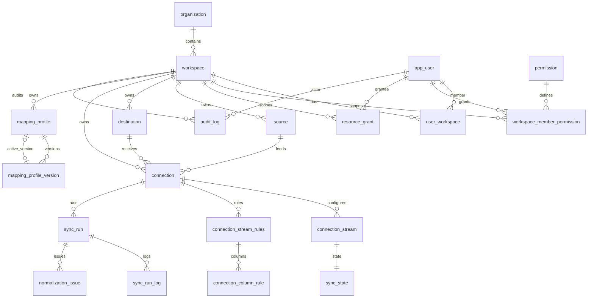

# Архитектура DataNorma

## Контекст

DataNorma — платформа интеграции и нормализации данных для МСП. Продуктовый контур построен по модели **ELT** (Airbyte-like):

- **источник** (`source`) — внешняя система или файл;
- **приёмник** (`destination`) — куда пишутся данные после извлечения и нормализации;
- **подключение** (`connection`) — связка source → destination с правилами колонок, расписанием и состоянием синка.

Нормализация выполняется per-stream правилами (`StreamRules` / `ColumnRule`) на этапе синка; бизнес-смысл задаётся маппингом колонок в мастере подключения.

## Структура кода (модульный монолит)

Один репозиторий, один Python-пакет `datanorma`, один Docker-образ. Разделение по модулям, не по микросервисам:

| Модуль | Назначение |
|--------|------------|
| `datanorma/web/` | FastAPI: REST API, JWT/RBAC, workspaces, UI (`/ui/`) |
| `datanorma/sources/` | Коннекторы источников (`check` / `discover` / `read`) |
| `datanorma/destinations/` | Приёмники (`check` / `write`) |
| `datanorma/elt/` | Прогон connection: source → normalize → destination, `sync_mode_policy` |
| `datanorma/normalization/` | Правила колонок, `cast_row`, issues |
| `datanorma/warehouse/` | `sync_state`, raw staging, динамические `normalized.*` таблицы |
| `datanorma/ingest/` | Конфиг потоков, cursor filter, Dagster warehouse streams |
| `datanorma/core/` | Модели Ingest Protocol (`SyncMode`, `DestinationSyncMode`, …) |
| `datanorma/http/` | HTTP-клиент для REST-коннекторов |
| `datanorma/integrations/` | OAuth Google Sheets |
| `datanorma/resources/` | Dagster resources (`PostgresResource`, `DataPathsResource`) |
| `datanorma/schedules/` | Cron по подключениям, scheduler в FastAPI |
| `datanorma/assets/` | Dagster assets (raw → normalized → dbt, demo-контур) |
| `datanorma/checks/` | Dagster asset checks (data quality) |
| `client/` | React/Vite SPA |
| `alembic/` | Миграции метаданных приложения |

## Источники (внешние)

Контракт каждого source connector: `check` → `discover` → `read(stream_name, sync_mode, cursor…)`.

| Код | Система | Layout в мастере | Примечание |
|-----|---------|------------------|------------|
| `google_sheet` | Google Sheets | **flat** | одна таблица полей |
| `bitrix24` | Bitrix24 CRM | **entities** | `crm_deals`, `crm_contacts`, `crm_leads`, `crm_companies`, `crm_tasks`, `crm_activities` |
| `moysklad` | МойСклад | **entities** | заказы, товары, остатки, … |
| `amocrm` | amoCRM | **entities** | сделки, контакты, компании, … |
| `yandex_metrika` | Яндекс Метрика | **entities** | summary, visits, hits, goals_reaches |
| `rest_builder` | REST API (YAML) | **flat** / **entities** | потоки из формы или YAML; при одном потоке — layout `flat` |

Реализации: `datanorma/sources/`. Фикстуры для тестов — `data/fixtures/<connector>/` и `data/samples/`. Каталог в UI фильтруется в `client/src/lib/connector-catalog.ts`.

## Приёмники (destinations)

Приёмник — целевая система записи данных connection. Контракт: `check(config)` и `write(stream, records, schema, mode, config)`.

| Код | Тип | Назначение |
|-----|-----|------------|
| `postgres` | **Внешняя PostgreSQL** | основной сценарий: БД заказчика / аналитическое хранилище |
| `clickhouse` | ClickHouse (HTTP) | колоночное хранилище |
| `csv` | CSV-файл | выгрузка на диск (path в config) |
| `xlsx` | Excel-файл | выгрузка на диск |

Реализации: `datanorma/destinations/`.

### Две роли PostgreSQL

1. **Внутренняя БД приложения** (`DATABASE_URL`) — метаданные: users, workspaces, sources, destinations, connections, sync_runs, normalization_issue, sync_state.
2. **Внешний приёмник `postgres`** — отдельный инстанс; URL задаётся в config destination (`url`, `schema`, `table`, `primary_key`). Синк connection пишет туда через `PostgresDestination`.

Для продуктового использования **рекомендуется явно указывать внешний URL** приёмника, а не полагаться на fallback к `DATABASE_URL`.

## Основной поток (ELT connection)

1. **extract** — `source.read` для каждого включённого stream connection.
2. **normalize** — `cast_row` по `connection_column_rule` / stream rules (типы, телефон, email, ИНН, даты МСК и т.д.); ошибки → `normalization_issue`.
3. **load** — `destination_write` в выбранный приёмник; режим записи определяется парой `sync_mode` + `destination_sync_mode` (см. ниже).
4. **state** — обновление `sync_state` per `connection_stream` (курсор в `ingest_state`).
5. **complete** — статус `sync_run`, audit, issues в UI.

Оркестрация: `run_connection_sync` inline в процессе FastAPI (`run_sync_inline_for_connection`). Расписания — `connection_cron_runner` + фоновый scheduler в FastAPI (`DATANORMA_CONNECTION_SCHEDULER`, по умолчанию вкл., `0` — отключить).

Inline sync **не** запускает dbt. Витрины `semantic.*` — отдельный шаг (`dbt run` или Dagster asset `dbt_run`).

## Режимы репликации (sync_mode + destination_sync_mode)

Как в Ingest/Airbyte, режим задаётся **парой** полей в `connection_stream`:

| Пресет UI | `sync_mode` | `destination_sync_mode` | Поведение записи |
|-----------|-------------|-------------------------|------------------|
| Полная выгрузка — перезапись | `full_refresh` | `refresh_overwrite` | Очистка + полная загрузка |
| Полная выгрузка — добавление | `full_refresh` | `refresh_append` | Полное чтение, append в приёмник |
| Инкремент — добавление | `incremental` | `append` | Чтение по курсору, append |
| Инкремент — дедупликация | `incremental` | `append_dedup` | Инкремент + upsert по `primary_key` |

Маппинг в `WriteMode` приёмника: `datanorma/elt/sync_mode_policy.py` (`resolve_write_mode`). Дефолты per connector/stream: `datanorma/web/connector_schema_meta.py`. UI: `StreamReplicationModeEditor`, `client/src/lib/destination-sync-mode.ts`.

## Компоненты инфраструктуры

- **API и UI:** FastAPI (`datanorma/web/`), React SPA (`client/`), раздача сборки под `/ui/`.
- **Метаданные:** PostgreSQL + Alembic (head: `018_sync_state_cascade_on_stream_delete`).
- **Деплой:** Docker / docker-compose / Helm.

## Dagster warehouse-контур (опционально)

Параллельный batch-путь для демо и dbt, не обязателен для продуктового ELT:

```
sync_catalog → raw_* assets → staging_postgres → normalized_orders → dbt_run → semantic.*
```

Активные потоки (`datanorma/ingest/dagster_streams.py`):

| integration_code | stream_name | raw asset | staging table |
|------------------|-------------|-----------|---------------|
| `google_sheet` | `orders` | `raw_google_sheet_orders` | `raw_google_sheet_orders_staging` |
| `bitrix24` | `crm_deals` | `raw_bitrix24_crm_deals` | `raw_bitrix24_crm_deals_staging` |

Запуск: `dagster dev -m datanorma.definitions`. Sensor `connection_cron_sensor` дублирует cron при отсутствии FastAPI scheduler.

## Мастер подключения (UX)

Пользователь настраивает **колонки, типы и режим репликации**, а не «потоки» Airbyte:

- **flat**-источники (Google Sheets, REST Builder с одним потоком): одна схема, таблица полей без выбора сущности.
- **entities**-источники (Bitrix24, amoCRM, МойСклад, Яндекс Метрика, REST Builder с несколькими потоками): чекбоксы сущностей + колонка «Сущность» в маппинге.
- Шаг **«Режим передачи данных»**: пресеты репликации (`full_overwrite`, `incremental_dedup`, …) → `sync_mode` + `destination_sync_mode`; при инкременте — выбор `cursor_field` и `primary_key`.
- `sync_mode` / `cursor_field` по умолчанию подставляются из `connector_schema_meta` и могут быть переопределены в мастере или на странице `/connections/:id/streams`.
- Правила сохраняются в `connection.wizard_meta`, `connection_stream`, `connection_stream_rules`, `connection_column_rule`; синк применяет `cast_row` при наличии правил.

Внутренний контракт коннекторов (`discover` / `read` по `stream_name`) сохранён для совместимости с Ingest Protocol (`datanorma/core/ingest_protocol.py`).

## Схема метаданных (внутренняя PostgreSQL)

Актуальная логическая модель после миграций Alembic (`018_sync_state_cascade_on_stream_delete`). Описаны только таблицы продуктового ELT-контура.

Миграции: `alembic/versions/`. Динамические таблицы данных (слои `raw` / `normalized` / `semantic`) — в [`docs/data_layers.md`](data_layers.md).

### ER-диаграмма (метаданные)



### Тенант и доступ

| Таблица | Назначение | Ключевые поля |
|---------|------------|---------------|
| `organization` | Организация-владелец | `id`, `code` (UK), `name` |
| `workspace` | Изолированное пространство данных | `id`, `organization_id` → `organization`, `code` (глобально UK), `name`, `created_by_user_id` → `app_user` |
| `app_user` | Учётная запись | `id`, `username` (UK), `password_hash`, `email`, `is_active`, `created_at` |
| `user_workspace` | Членство пользователя в workspace | PK (`user_id`, `workspace_id`), `is_admin` |
| `permission` | Каталог прав (seed) | `code` (PK), `description_ru`, `category` |
| `workspace_member_permission` | Права участника в workspace | PK (`workspace_id`, `user_id`, `permission_code`) |
| `resource_grant` | Точечный доступ к source/destination/connection | `workspace_id`, `resource_type`, `resource_id`, `grantee_user_id`, `level` (`view` / `edit` / `manage`) |

Глобальные роли `role` / `user_role` в БД могут оставаться для `platform_admin`, но **авторизация ELT-ресурсов** опирается на `workspace_member_permission` и `resource_grant`.

### ELT-контур

| Таблица | Назначение | Ключевые поля |
|---------|------------|---------------|
| `source` | Подключённый источник | `workspace_id`, `connector_code`, `config_encrypted` (JSON), `status`, `created_by_user_id`, `last_checked_at` |
| `destination` | Приёмник записи | те же поля, что у `source` |
| `connection` | Связка source → destination | `source_id`, `destination_id`, `schedule_cron`, `timezone`, `is_active`, `wizard_meta` (JSONB), `created_by_user_id` |
| `connection_stream` | Включённый поток в подключении | UK (`connection_id`, `stream_name`); `sync_mode`, `destination_sync_mode`, `cursor_field`, `primary_key`, `is_enabled`, `cursor_value`, `mapping_profile_id` |

### Правила нормализации (мастер подключения)

| Таблица | Назначение | Ключевые поля |
|---------|------------|---------------|
| `connection_stream_rules` | Правила потока для `cast_row` | UK (`connection_id`, `stream_name`); `sync_mode`, `cursor_field`, `primary_key` (JSONB), `drop_unknown_columns`, `deduplicate`, `enabled` |
| `connection_column_rule` | Правило колонки | UK (`stream_rules_id`, `target_field`); `source_field`, `type`, `nullable`, `required`, `params`, `on_error`, `sort_order` |
| `normalized_table_meta` | Реестр эволюции normalized-таблиц | UK (`connection_id`, `stream_name`); `schema_name`, `table_name`, `columns` (JSONB), `last_evolved_at` |

### Синхронизация и состояние

| Таблица | Назначение | Ключевые поля |
|---------|------------|---------------|
| `sync_state` | Курсор и ingest-state **на поток connection** | UK по `connection_stream_id` (актуальный путь); legacy UK по (`integration_code`, `stream_name`) где `connection_stream_id IS NULL`; `sync_mode`, `cursor_field`, `cursor_value`, `ingest_state` (JSONB), `workspace_id`, `last_success_at`. FK на `connection_stream` — `ON DELETE CASCADE` (миграция 018) |
| `sync_run` | Запуск синка connection | `domain_connection_id` → `connection`, `workspace_id`, `status` (`queued` / `running` / `success` / `failed` / `cancelled`), `dagster_run_id`, `triggered_by`, `meta` (JSONB) |
| `sync_run_log` | Пошаговые логи прогона | `sync_run_id`, `stage`, `level`, `message`, `technical_details`, `record_ref` |
| `normalization_issue` | Ошибки `cast_row` за прогон | `sync_run_id`, `connection_id`, `stream_name`, `target_field`, `error_code`, `error_text`, `raw_value`; `status` (`open` / `resolved` / `ignored`), `resolved_at`, `resolved_by`, `resolution_note` |

### Профили маппинга (опционально)

| Таблица | Назначение | Ключевые поля |
|---------|------------|---------------|
| `mapping_profile` | Именованный профиль правил | UK (`workspace_id`, `source_type`, `stream_name`, `profile_name`); `active_version_id`, `is_active` |
| `mapping_profile_version` | Версия профиля | UK (`profile_id`, `version`); `status` (`draft` / `published` / `archived`), `rules_json` |

`connection_stream.mapping_profile_id` ссылается на профиль; в мастере подключения основной путь — `connection_stream_rules` + `connection_column_rule`.

### Аудит

| Таблица | Назначение |
|---------|------------|
| `audit_log` | Действия с security-следом: `workspace_id`, `actor_user_id`, `action`, `resource_type`, `resource_id`, `result`, `payload_json`, `ip_address`, `created_at` |

### Данные синка (вне метаданных)

Сами строки бизнес-данных **не хранятся** в таблицах выше. Запись идёт в выбранный приёмник:

- **Внешний `postgres` / `clickhouse`** — схема и таблица из `destination.config` (`schema`, `table`, `primary_key`).
- **Файлы `csv` / `xlsx`** — путь из config.

При использовании внутреннего warehouse-контура таблицы создаются динамически: `normalized.<connector_code>__<stream_name>` (колонки из `connection_column_rule` + технические `_ingest_*`, `_source_record_id`, опционально `_raw`). См. `datanorma/warehouse/tables.py`.

## Связанные документы

- `docs/connectors.md` — контракт коннекторов и каталог.
- `docs/backend.md` — модули backend.
- `docs/frontend.md` — UI и мастер подключения.
